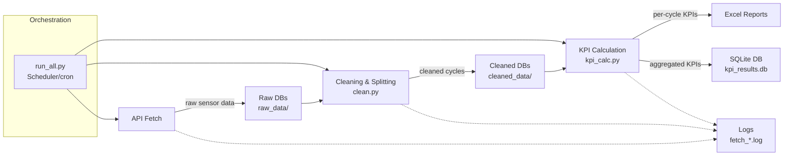

# Data Pipeline for IoT Sensor Data (Industrial Process Example)


-brightgreen)


This repository demonstrates generic IoT data pipeline patterns with synthetic/placeholder naming. It does not contain company data.

## 1. Overview

This project implements a modular, fault-tolerant pipeline for processing IoT sensor data from an industrial process environment. As an example, the pipeline is framed around direct air capture operations, but all data and sensor names are illustrative only.

Originally built for daily operations at an industrial CO₂ capture facility, this pipeline processed **20GB of sensor data** across multiple capture units, calculating 30+ engineering KPIs per cycle to support leadership reporting and performance evaluation.

It demonstrates core data engineering practices:

1. **Automated** – Scheduled daily batch processing via Windows Task Scheduler.
2. **Idempotent** – Deterministic logic allows safe re-runs without data duplication.
3. **Multi-Stage Incrementalism** – Checks state at each phase (Raw/Clean/Calc) to skip redundant processing.
4. **Fault Isolation** – Unit-level failures are isolated to prevent total pipeline halts.
5. **Modular** – Decoupled logic for Ingestion, Transformation, and Analytics engineering.
6. **Observability** – Structured logging and metadata tracking for system health.

Each run of the pipeline:  
1. **fetches** time-series sensor data via API  
2. **cleans & splits** the data into complete adsorption/desorption cycles  
3. **calculates** 30+ KPIs per cycle, storing results in a consolidated database  

---

## 2. Folder layout

```
project_root/
├─ code/                 # all .py source files
│   ├─ fetch.py       # fetch raw data → raw_data/*.db
│   ├─ clean.py # clean/split → cleaned_data/*.db
│   ├─ kpi_calc.py        # calculate KPIs → results/*.xlsx and kpi_results.db
│   ├─ config.py          # .env credentials, date range, metric list
│   └─ run_all.py         # driver – RUN THIS CODE
│
├─ scheduler.xml          # Task Scheduler (Windows) XML definition
├─ raw_data/              # <date>_UnitX_rawdata.db
├─ cleaned_data/          # <date>_UnitX_ProcessData.db
├─ results/               # kpi_results.db and per-unit Excel files
├─ logs/                  # log files per run
│   ├─ fetch_YYYYMMDD_HHMMSS.log
│   └─ run_YYYYMMDD_HHMMSS.log
```

> **Note** – `raw_data/`, `cleaned_data/` and `results/` may be redirected to an external drive for storage efficiency. Logs always remain inside the project folder.  

---

## 3. Requirements

- **Python ≥ 3.9** (tested 3.11)  
- Dependencies: `requests`, `pandas`, `openpyxl`  

```bash
pip install -r requirements.txt
```  

- Task scheduler (Windows Task Scheduler used here, but portable to cron/Airflow)

---

## 4. Configuration

| File             | What to edit                                    |
| ---------------- | ----------------------------------------------- |
| `code/config.py` | API token, username, password, metrics list     |
| `.env`           | API secrets loaded via `dotenv`                 |
| `scheduler.xml`  | Ensure "Start in" is set to `code/`              |

> **Time-zone assumption** – API calls use UTC, fetching restricted to weekdays 06:00–21:00 UTC.  

---

## 5. KPI Units

All KPIs are stored in **SI-based units**. Sensor names are generic placeholders (e.g., flow_rate, concentration_sensor_A) to illustrate the methodology. Example KPIs:  

| KPI column name                    | Unit      | Notes                                      |
| ---------------------------------- | --------- | ------------------------------------------ |
| `Total power consumption`          | kWh       | Total cycle energy                         |
| `Mass CO₂ process`                 | t CO₂     | Tonnes CO₂ captured per cycle               |
| `Energy per mass CO₂`              | kWh/t CO₂ | Specific energy consumption                 |
| `Mean temperature adsorption`      | °C        | Average during adsorption                   |
| `Mean CO₂ concentration adsorption`| ppm       | concentration_sensor_A                                 |
| `CO₂ mass flow`                    | kg/s      | Instantaneous flow = flow_rate × concentration_sensor_A / 100        |

---

## 6. How the pipeline works


**State Verification**

- run_all.py performs a multi-stage check to identify the "Delta" (new data).

- Skip Logic: Data is not extracted if a Raw DB exists, not cleaned if a Cleaned DB exists, and not recalculated if entries exist in the Final DB.

**Orchestration & Failure Propagation**

- Steps execute sequentially via subprocess.run().

- The orchestrator captures non-zero exit codes; if a unit fails a specific stage, it is logged and the orchestrator moves to the next unit.

**Fetch (Ingestion)**

- Retrieves time-series data in 30-minute slices.
- Applies domain filtering to exclude non-operational windows (weekends/off-hours).
  
---

## 7. Quickstart

```bash
git clone <repo>
cd code/
python -m venv .venv
.venv/Scripts/pip install -r requirements.txt
python run_all.py --dry-run
```

---

## 8. Example outputs

- Per-unit Excel files with KPIs  
- Consolidated SQLite database `kpi_results.db`  

For example (dummy data): 

| date       | unit   | mass_co2_t | energy_kwh_per_t | compliant |
|------------|--------|------------|------------------|-----------|
| 2024-03-01 | Unit_A | 1.24       | 412.3            | Y        |
| 2024-03-01 | Unit_B | 0.98       | 438.7            | Y        |
---

## 9. Troubleshooting

| Symptom                            | Likely cause        | Fix                                     |
| ---------------------------------- | ------------------- | --------------------------------------- |
| Duplicate `_Results_1.xlsx`        | Outdated KPI logic  | Pull latest code                        |
| `Auth failed` in logs              | Invalid credentials | Update `.env`                           |
| Task Scheduler error 0x1           | Python exception    | Check `logs/run_*.log` for traceback    |

---

## 10. Robustness

- Multi-Stage Resumption: If the pipeline is interrupted, it resumes from the last successful stage (Extraction, Cleaning, or Calculation) rather than restarting the entire daily batch.

- Atomic Unit Processing: Each unit-day pair is processed as an isolated transaction, ensuring that a single sensor failure does not impact the availability of data for other units.

- Data Integrity Gates: In-pipeline checks prevent "poison pill" data (e.g., sensor spikes or negatives) from propagating into the final KPI database. 
---

## 11. Methodology

- **Acquisition**: Data retrieved via API in 30-minute slices, merged into per-unit SQLite DBs.  
- **Cleaning**: Remove anomalies, clip concentration at 100%, split into adsorption/desorption cycles.  
- **KPI calculation**: Mass CO₂, energy consumption, annualised output, energy per mass CO₂.  
- **Validation**: Negative/NaN checks, cross-checks against raw data, daily totals validated.  

---
## 12. Testing & Data Quality

The pipeline includes two layers of validation:

**pytest suite** covering pipeline logic:
- Fetch: skip logic for existing files, weekends, and out-of-window hours
- Cleaning: spike clipping, cycle splitting, incomplete reading detection
- KPI calculation: expected output ranges, NaN/negative checks
- Factor assignment: raw value → process name mapping correctness

**In-pipeline data quality checks** running on every execution:
- KPI sanity checks: values validated against physically expected ranges
- Outlier detection: statistical flags written directly to the results database
- Cross-validation: daily totals checked against raw sensor readings
- Flagging: anomalous cycles are marked in `kpi_results.db` rather than silently dropped
---
## 13. Notes on scheduling

This pipeline is orchestrated via **Windows Task Scheduler**, appropriate for the single-machine, daily-batch context it was built for. The modular `run_all.py` driver is portable. The same logic could be wrapped in cron, Airflow, or Dagster without changing the underlying pipeline code.

---

## 14. Licence

For demonstration purposes only.  
