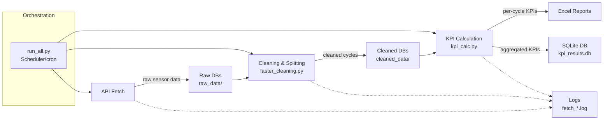

# Data Pipeline for IoT Sensor Data (Direct Air Capture Example)

## 1. Overview

This project implements a modular, fault-tolerant pipeline for processing IoT sensor data. It demonstrates core data engineering practices:  

1. **Automated** – scheduled to run daily at a fixed time  
2. **Reproducible** – each step is deterministic and idempotent  
3. **Incremental** – previously processed files are skipped automatically  
4. **Robust** – partial failures do not stop the entire pipeline  
5. **Maintainable** – source code is separated by function (fetch → clean → calculate)  
6. **Traceable** – logs and checkpoints provide transparency and easy debugging  

Each run of the pipeline:  
1. **fetches** time-series sensor data via API  
2. **cleans & splits** the data into complete adsorption/desorption cycles  
3. **calculates** 30+ KPIs per cycle, storing results in a consolidated database  

---

## 2. Folder layout

```
project_root/
├─ code/                 # all .py source files
│   ├─ fetch_all.py       # fetch raw data → raw_data/*.db
│   ├─ faster_cleaning.py # clean/split → cleaned_data/*.db
│   ├─ kpi_calc.py        # calculate KPIs → results/*.xlsx and kpi_results.db
│   ├─ config.py          # .env credentials, date range, metric list
│   └─ run_all.py         # driver – RUN THIS CODE
│
├─ scheduler.xml          # Task Scheduler (Windows) XML definition
├─ raw_data/              # <date>_UnitX_rawdata.db
├─ cleaned_data/          # <date>_UnitX_ProcessData.db
├─ results/               # kpi_results.db and per-unit Excel files
├─ logs/                  # log files per run
│   ├─ fetch_YYYYMMDD_HHMMSS.log
│   └─ run_YYYYMMDD_HHMMSS.log
```

> **Note** – `raw_data/`, `cleaned_data/` and `results/` may be redirected to an external drive for storage efficiency. Logs always remain inside the project folder.  

---

## 3. Requirements

- **Python ≥ 3.9** (tested 3.11)  
- Dependencies: `requests`, `pandas`, `openpyxl`  

```bash
pip install -r requirements.txt
```  

- Task scheduler (Windows Task Scheduler used here, but portable to cron/Airflow)

---

## 4. Configuration

| File             | What to edit                                    |
| ---------------- | ----------------------------------------------- |
| `code/config.py` | API token, username, password, metrics list     |
| `.env`           | API secrets loaded via `dotenv`                 |
| `scheduler.xml`  | Ensure "Start in" is set to `code/`              |

> **Time-zone assumption** – API calls use UTC, fetching restricted to weekdays 06:00–21:00 UTC.  

---

## 5. KPI Units

All KPIs are stored in **SI-based units**. Examples:  

| KPI column name                    | Unit      | Notes                                      |
| ---------------------------------- | --------- | ------------------------------------------ |
| `Power consumption total`          | kWh       | Total cycle energy                         |
| `Mass CO₂ process`                 | t CO₂     | Tonnes CO₂ captured per cycle               |
| `Energy per mass CO₂`              | kWh/t CO₂ | Specific energy consumption                 |
| `Mean temperature adsorption`      | °C        | Average during adsorption                   |
| `Mean CO₂ concentration adsorption`| ppm       | Sensor CR1                                 |
| `CO₂ mass flow`                    | kg/s      | Instantaneous flow = FR1 × CR1 / 100        |

---

## 6. How the pipeline works



1. **Determine target day**  
   - `run_all.py` checks Excel result files in `results/` to identify the latest processed date.  
   - Weekends are skipped.  

2. **Run pipeline components**  
   - Steps are executed sequentially via `subprocess.run()`: fetch → clean → calculate.  
   - If one step fails for a date, processing stops for that date but continues for others.  

3. **Fetch raw data**  
   - `fetch_all.py` retrieves API data for each unit.  
   - Skips existing unit/day files, weekends, and out-of-window hours.  

4. **Clean**  
   - `faster_cleaning.py` removes incomplete readings, clips sensor spikes, and splits cycles.  
   - Results saved as `<date>_UnitX_ProcessData.db` in `cleaned_data/`.  

5. **Calculate KPIs**  
   - `kpi_calc.py` computes 30+ KPIs per cycle.  
   - Results are written to per-unit Excel files and the consolidated SQLite database `kpi_results.db`.  
   - Skips already processed unit/day files.  

6. **Logging and checkpoints**  
   - Each run creates timestamped logs in `logs/`.  
   - Logs capture orchestration, runtimes, warnings, and errors.  

---

## 7. Quickstart

```bash
git clone <repo>
cd code/
python -m venv .venv
.venv/Scripts/pip install -r requirements.txt
python run_all.py --dry-run
```

---

## 8. Example outputs

- Per-unit Excel files with KPIs  
- Consolidated SQLite database `kpi_results.db`  

---

## 9. Troubleshooting

| Symptom                            | Likely cause        | Fix                                     |
| ---------------------------------- | ------------------- | --------------------------------------- |
| Duplicate `_Results_1.xlsx`        | Outdated KPI logic  | Pull latest code                        |
| `Auth failed` in logs              | Invalid credentials | Update `.env`                           |
| Task Scheduler error 0x1           | Python exception    | Check `logs/run_*.log` for traceback    |

---

## 10. Robustness

- Raw data files are retained but can be deleted once cleaned equivalents are validated.  
- If `kpi_results.db` is corrupted, delete it and rerun — it will be regenerated in full.  

---

## 11. Methodology

- **Acquisition**: Data retrieved via API in 30-minute slices, merged into per-unit SQLite DBs.  
- **Cleaning**: Remove anomalies, clip concentration at 100%, split into adsorption/desorption cycles.  
- **KPI calculation**: Mass CO₂, energy consumption, annualised output, energy per mass CO₂.  
- **Validation**: Negative/NaN checks, cross-checks against raw data, daily totals validated.  

---

## 12. Notes on scheduling

This project demonstrates scheduling with **Windows Task Scheduler**. In production, the same orchestration could run under **cron, Airflow, Prefect, or Dagster** for scalability.  

---

## 13. Licence

For demonstration purposes only.  
